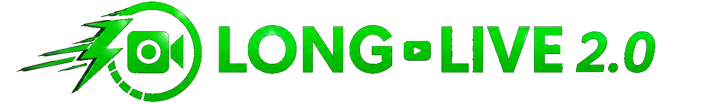
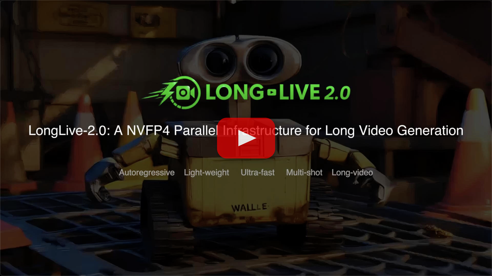
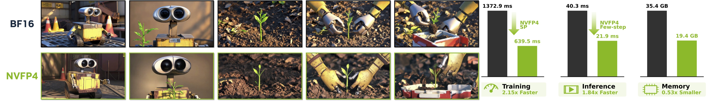
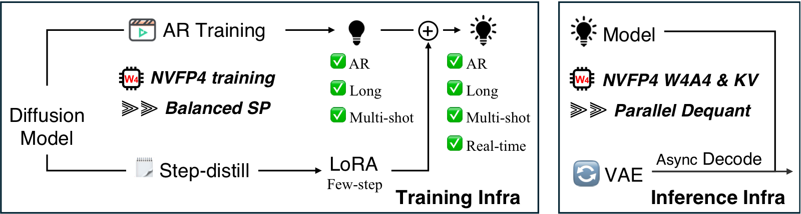
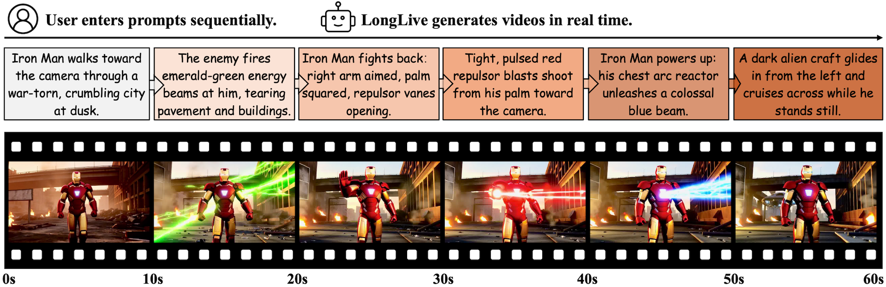

<p align="center" style="border-radius: 10px">
  
</p>

# 🎬 LongLive 2.0: An NVFP4 Parallel Infrastructure for Long Video Generation

[](https://arxiv.org/abs/2605.18739)
[](https://github.com/NVlabs/LongLive/tree/v1.0)
[](https://github.com/qixinhu11/LongLive-RAG)
[](https://www.youtube.com/watch?v=7oQALy32fiU)
[](https://github.com/NVlabs/LongLive)
[](https://nvlabs.github.io/LongLive/LongLive2/)
[](https://nvlabs.github.io/LongLive/LongLive2/docs/)


<div align="center">

<!-- TODO: replace this text block with the final project-page video/demo embed. -->

[](https://www.youtube.com/watch?v=7oQALy32fiU)

</div>

## 💡 TLDR: Infra with NVFP4 and parallelism for both training and inference

<p align="center" style="border-radius: 10px">
  
</p>

## News
- 🔥 [2026.06.01] We released [LongLive-RAG](https://github.com/qixinhu11/LongLive-RAG), a general retrieval-augmented framework for long video gen.
- 🔥 [2026.05.30] LongLive2.0 now supports I2V AR teacher-forcing training and I2V DMD distillation for Wan2.2-TI2V-5B.
- ⚡ [2026.05.25] We optimized the NVFP4 inference path with fused Triton RoPE/adaLN kernels, reduced KV-cache synchronization overhead, in-place quantized KV-cache updates, faster FP4 KV dequantization, pinned VAE transfers, and safer LoRA-before-quantization setup, improving overall throughput by **18.6%**.
- 🔥 [2026.05.13] We release **LongLive 2.0**, infra with NVFP4, parallelism and multi-shot for AR training, DMD distillation, and inference (⚡45.7 FPS). The original LongLive 1.0 is now in the [v1.0](https://github.com/NVlabs/LongLive/tree/v1.0) branch.
- 🔥 [2026.04.12] LongLive supports kv cache compression with [TriAttention](https://github.com/WeianMao/triattention), with 50% KV reduction and no quality drop. Check it [here](https://github.com/WeianMao/triattention/tree/main/longlive)
- 🎉 [2026.1.27] LongLive is accepted by **ICLR-2026**.
- 🔥 [2026.1.11] LongLive supports adapting LongLive's original RoPE into KV-cache relative RoPE and generates infinite long videos!
- 🔥 [2025.11.3] We implement LongLive on linear attention model [SANA-Video](https://nvlabs.github.io/Sana/Video/)! Now SANA-Video can generate 60s interactive videos in real-time.
- 🔥 [2025.9.29] We release [Paper](https://arxiv.org/abs/2509.22622), this GitHub repo [LongLive](https://github.com/NVlabs/LongLive) with all training and inference code, the model weight [LongLive-1.3B](https://huggingface.co/Efficient-Large-Model/LongLive-1.3B), and demo page [Website](https://nvlabs.github.io/LongLive).

## Introduction

**LongLive 1.0**: Real-time Interactive Long Video Generation. [You can find it here](https://github.com/NVlabs/LongLive/tree/v1.0) in our V1.0 branch.

**LongLive 2.0**: an NVFP4 Parallel Infrastructure for Long Video Generation
- For training, it supports
  - [x] Balanced sequence parallel for T2V/I2V AR training (teacher-forcing).
  - [x] T2V/I2V AR training on multi-shot (or single-shot) videos.
  - [x] NVFP4 (or BF16) for both AR training and few-step distillation.
- For inference, it supports
  - [x] NVFP4 inference (W4A4) and NVFP4 KV Cache.
  - [x] TorchAO FP8 PTQ inference (W8A8) from the BF16 checkpoint.
  - [x] Multi-shot attention sink.
  - [x] Sequence parallel inference.
  - [x] Async decoding.


<p align="left" style="border-radius: 10px">
  
</p>


**LongLive 1.0**: Real-time Interactive Long Video Generation. It accepts sequential user prompts and generates corresponding videos in real time, enabling user-guided long video generation. The key insights are attention sink, KV-recache, and streaming long tuning. 


<p align="left" style="border-radius: 10px">
  
</p>

## Getting Started
- [Full Documentation](https://nvlabs.github.io/LongLive/LongLive2/docs/)
- [Installation](https://nvlabs.github.io/LongLive/LongLive2/docs/#installation)
- [NVFP4 Setup](https://nvlabs.github.io/LongLive/LongLive2/docs/#nvfp4-installation)
- [Training Modes](https://nvlabs.github.io/LongLive/LongLive2/docs/#training)
- [Inference](https://nvlabs.github.io/LongLive/LongLive2/docs/#inference)
- [Data Organization](https://nvlabs.github.io/LongLive/LongLive2/docs/#training-data)


The default git clone fetches objects from all branches, including our demopage branch, which contains large assets. For normal use, only the main branch is needed. Please clone only main with:

```git clone --single-branch --branch main --depth 1 https://github.com/NVlabs/LongLive.git```

### Quick Start

#### BF16

```python
import torch
from omegaconf import OmegaConf

from pipeline import CausalDiffusionInferencePipeline
from utils.config import normalize_config
from utils.inference_utils import (
    load_generator_checkpoint,
    place_vae_for_streaming,
    prepare_single_prompt_inputs,
    save_video,
)

prompt = "A compact silver robot walks through a clean robotics lab."
merged_checkpoint_path = "LongLive-2.0-5B/model_bf16.pt"

config = normalize_config(OmegaConf.load("configs/inference.yaml"))
device = torch.device("cuda")

torch.set_grad_enabled(False)
pipe = CausalDiffusionInferencePipeline(config, device=device)
load_generator_checkpoint(pipe.generator, merged_checkpoint_path)
pipe = pipe.to(device=device, dtype=torch.bfloat16)
place_vae_for_streaming(pipe, config)  # honor streaming_vae + vae_device when set
pipe.generator.model.eval().requires_grad_(False)

noise, prompts = prepare_single_prompt_inputs(config, prompt, device)
video = pipe.inference(noise=noise, text_prompts=prompts)
save_video(video[0], "videos/quickstart/sample.mp4", fps=24)
```

`place_vae_for_streaming` is a no-op unless `inference.streaming_vae` is true and `inference.vae_device` is set, so toggling streaming-pipeline decode in your yaml is enough — the script does not need to change.

#### FP8 PTQ

Download `model_bf16.pt` from
[`Efficient-Large-Model/LongLive-2.0-5B`](https://huggingface.co/Efficient-Large-Model/LongLive-2.0-5B),
set `checkpoints.generator_ckpt` in `configs/fp8/inference_fp8.yaml`, and run:

```bash
python inference.py --config_path configs/fp8/inference_fp8.yaml
```

This loads the BF16 generator, applies TorchAO row-wise dynamic FP8 W8A8 PTQ,
and then enables the existing `torch.compile` path. With the provided 5B model,
300 eligible core Linear layers use FP8; six small conditioning/output
projections stay in BF16 for stability and to avoid FP8 overhead.

The validated stack is Python 3.10, PyTorch 2.8.0+cu128, and TorchAO 0.13.0 on
H100 (SM90); compute capability 8.9 or newer is required. The supplied config
uses `torch_compile: auto`. Its `max-autotune` warm-up can take several minutes
while guard/shape variants are compiled, so use repeated inference and exclude
all compile/warm-up samples when measuring steady-state performance. Set
`torch_compile: false` for a short eager-mode smoke test.

The supplied config uses the single 8-latent-frame block validated on H100.
Longer generation introduces additional KV-cache shapes and may trigger more
compilation or eager fallback; validate the intended frame count before
benchmarking or deployment.

#### NVFP4

Point `checkpoints.generator_ckpt` in `configs/nvfp4/inference_nvfp4.yaml` at the downloaded checkpoint and set `model_quant_use_transformer_engine` according to the backend you are using:

- TransformerEngine checkpoint (`model_te.pt`): `model_quant_use_transformer_engine: true`
- FourOverSix checkpoint (`model_4o6.pt`): `model_quant_use_transformer_engine: false`

`setup_nvfp4_pipeline` handles checkpoint loading, NVFP4 module wrapping, weight materialization, dtype/device placement, and the streaming-pipeline VAE relocation for both backends — the bf16 `pipe.to(...)` shortcut is unsafe here because it would cast the quantized buffers.

```python
import torch
from omegaconf import OmegaConf

from pipeline import CausalDiffusionInferencePipeline
from utils.config import normalize_config
from utils.inference_utils import prepare_single_prompt_inputs, save_video, setup_nvfp4_pipeline

prompt = "A compact silver robot walks through a clean robotics lab."

config = normalize_config(OmegaConf.load("configs/nvfp4/inference_nvfp4.yaml"))
device = torch.device("cuda")

torch.set_grad_enabled(False)
pipe = CausalDiffusionInferencePipeline(config, device=device)
setup_nvfp4_pipeline(pipe, config, device)
pipe.generator.model.eval().requires_grad_(False)

noise, prompts = prepare_single_prompt_inputs(config, prompt, device)
video = pipe.inference(noise=noise, text_prompts=prompts)
save_video(video[0], "videos/quickstart/sample_nvfp4.mp4", fps=24)
```

## Training Modes

LongLive2.0 supports both T2V and I2V training. Each modality follows the same two-stage recipe: AR teacher-forcing training first, then DMD distillation from the AR checkpoint.

### T2V Training

```bash
torchrun --standalone --nnodes=1 --nproc_per_node=8 train.py \
  --config_path configs/train_ar.yaml \
  --logdir logs/train_ar \
  --wandb-save-dir wandb \
  --disable-wandb

torchrun --standalone --nnodes=1 --nproc_per_node=8 train.py \
  --config_path configs/train_dmd.yaml \
  --logdir logs/train_dmd \
  --wandb-save-dir wandb \
  --disable-wandb
```

### I2V Training

```bash
torchrun --standalone --nnodes=1 --nproc_per_node=8 train.py \
  --config_path configs/train_i2v_ar.yaml \
  --logdir logs/train_i2v_ar \
  --wandb-save-dir wandb \
  --disable-wandb

torchrun --standalone --nnodes=1 --nproc_per_node=8 train.py \
  --config_path configs/train_i2v_dmd.yaml \
  --logdir logs/train_i2v_dmd \
  --wandb-save-dir wandb \
  --disable-wandb
```

For I2V configs, set `algorithm.i2v: true` and `algorithm.independent_first_frame: true`. `data.image_or_video_shape[1]` is the full latent sequence length, for example `96`, not `96 + 1`: the clean image latent replaces the first latent during denoising and that first latent is masked out of the training loss. For I2V DMD, set `checkpoints.generator_ckpt` to the I2V AR checkpoint used to initialize the student.

## Models

| Model | FPS ↑ | Params | VBench ↑ | Multi-shot |
| --- | ---: | ---: | ---: | :---: |
| [LongLive-1.3B](https://huggingface.co/Efficient-Large-Model/LongLive-1.3B) | 20.7 | 1.3B | 84.87 |  |
| [LongLive-2.0-5B](https://huggingface.co/Efficient-Large-Model/LongLive-2.0-5B) | 24.8 | 5B | 85.06 | ✅ |
| [LongLive-2.0-5B-NVFP4-4Step](https://huggingface.co/Efficient-Large-Model/LongLive-2.0-5B-NVFP4-S4) | 29.7 | 5B | 84.51 | ✅ |
| [LongLive-2.0-5B-NVFP4-2Step](https://huggingface.co/Efficient-Large-Model/LongLive-2.0-5B-NVFP4-S2) | 45.7 | 5B | 83.14 | ✅ |

## Awesome work using LongLive

- [DreamForge-World 0.1](https://trydreamforge.com/): Adapts the LongLive AR video stack with a residual action pathway for low-compute real-time controllable world modeling.
- [DreamX-World 1.0](https://arxiv.org/abs/2606.16993): Follows LongLive by adapting the model on long sequences with long rollouts and local temporal windows for stable long-horizon AR world generation.
- [SANA-Video](https://nvlabs.github.io/Sana/docs/longsana/): Combines SANA-Video with LongLive to build LongSANA, a real-time minute-long video generation variant with constant-memory KV cache.
- [Daydream Scope](https://docs.daydream.live/scope/reference/pipelines/longlive): Wraps LongLive as a streaming AR video diffusion pipeline for interactive text-to-video and video-to-video workflows.
- [MemFlow](https://github.com/KlingAIResearch/MemFlow): Builds on the LongLive codebase and adds adaptive memory retrieval for more consistent long narrative video generation.
- [ShotStream](https://github.com/KlingAIResearch/ShotStream): Builds on LongLive’s distillation procedure for real-time streaming multi-shot AR video generation.
- [Stream-T1](https://github.com/FrameX-AI/Stream-T1): Builds on LongLive's codebase and algorithm, adding test-time scaling with noise propagation, reward pruning, and memory sinking.
- [KVPO](https://github.com/Richard-Zhang-AI/KVPO): Builds on LongLive and related AR video codebases to perform GRPO-style alignment through historical KV semantic exploration.
- [LoL](https://github.com/justincui03/LoL): Builds on LongLive to study and mitigate sink-collapse for ultra-long AR streaming video generation.
- [TriAttention](https://github.com/WeianMao/triattention/tree/main/longlive): Integrates trigonometric KV-cache compression into LongLive's causal inference pipeline, reducing KV memory inside LongLive's local-attention window.
- [StreamEdit](https://github.com/DSL-Lab/StreamEdit): Provides a `LongLive_StreamEdit` implementation for training-free streaming video editing built on the LongLive v1.0 codebase.
- [Streaming Autoregressive Video Generation via Diagonal Distillation](https://github.com/Sphere-AI-Lab/diagdistill): Builds on the LongLive codebase and supports direct initialization from `LongLive-1.3B` checkpoints for streaming AR video distillation.
- [Forcing-KV](https://github.com/zju-jiyicheng/Forcing-KV): Adds hybrid KV-cache compression to LongLive, including LongLive inference and interactive-generation scripts.
- [Dummy Forcing](https://github.com/csguoh/DummyForcing): Unifies Self-Forcing, LongLive, and Causal-Forcing pipelines with LongLive inference, VBench, and interactive-generation configs.
- [MemRoPE](https://github.com/YoungRaeKimm/MemRoPE): Uses LongLive as a supported base model for training-free infinite video generation with evolving memory tokens.
- [Astrolabe](https://github.com/franklinz233/Astrolabe): Supports LongLive as a distilled autoregressive video backbone with LongLive-specific RL configs and LoRA initialization.


## License
This repository is released under the Apache 2.0 license. See [LICENSE](LICENSE) for details.

## Citation
Please consider citing our work if you find them useful:

```bibtex
@article{longlive_2.0,
  title={LongLive2.0: An NVFP4 Parallel Infrastructure for Long Video Generation},
  author={Chen, Yukang and Wang, Luozhou and Huang, Wei and Yang, Shuai and Zhang, Bohan and Xiao, Yicheng and Chu, Ruihang and Mao, Weian and Hu, Qixin and Liu, Shaoteng and Zhao, Yuyang and Mao, Huizi and Chen, Ying-Cong and Xie, Enze and Qi, Xiaojuan and Han, Song},
  journal={arXiv preprint arXiv: 2605.18739},
  year={2026}
}
```

```bibtex
@inproceedings{longlive,
    title={Longlive: Real-time interactive long video generation}, 
    author={Yang, Shuai and Huang, Wei and Chu, Ruihang and Xiao, Yicheng and Zhao, Yuyang and Wang, Xianbang and Li, Muyang and Xie, Enze and Chen, Yingcong and Lu, Yao and others},
    booktitle={ICLR},
    year={2026},
}
```

```bibtex
@article{longlive_rag,
  title         = {LongLive-RAG: A General Retrieval-Augmented Framework for Long Video Generation},
  author        = {Hu, Qixin and Yang, Shuai and Huang, Wei and Han, Song and Chen, Yukang},
  journal       = {arXiv preprint arXiv:2606.02553},
  year          = {2026}
}
```

## Acknowledgement
- [Self-Forcing](https://github.com/guandeh17/Self-Forcing): the AR training codebase and formulation we build upon.
- [Wan2.2](https://github.com/Wan-Video/Wan2.2): the base video diffusion model components used in this release.
